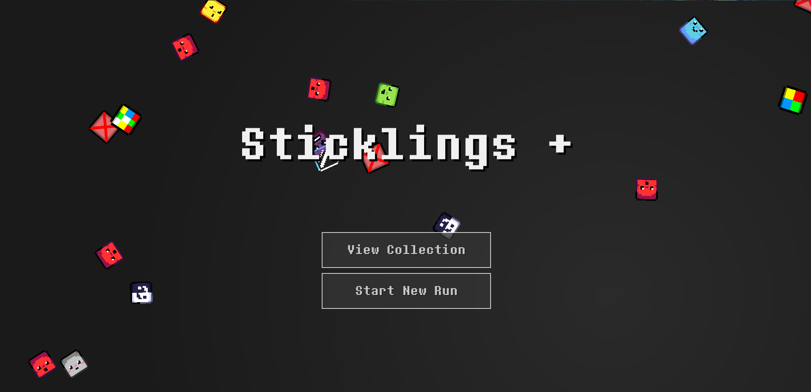
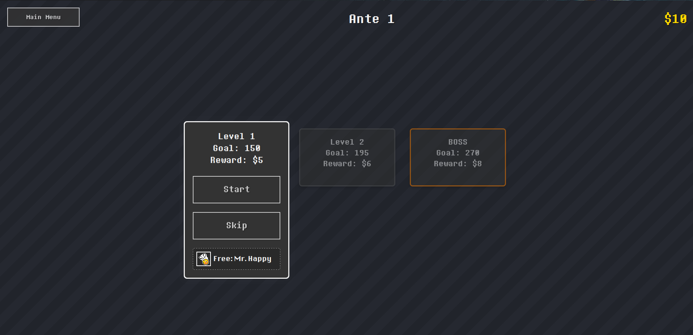
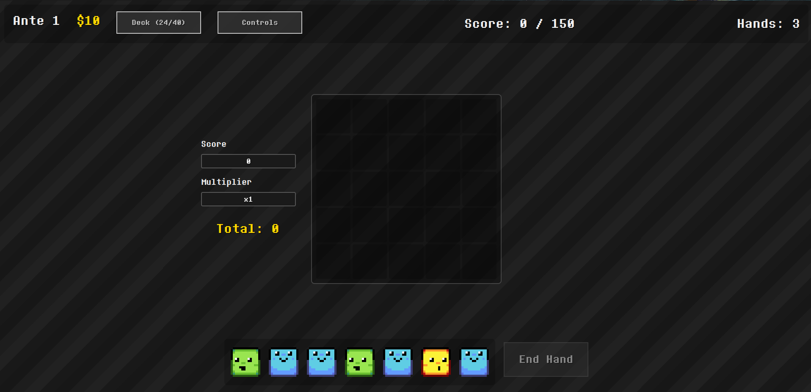
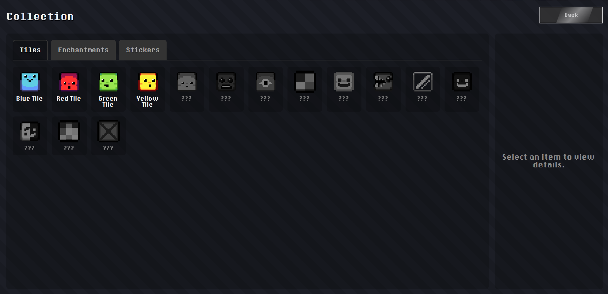

# Bienvenue dans Sticklines !

## TABLE DES MATIÈRES

1. UNE SITUATION DÉLICATE : Qu’est-ce que Sticklines ?
    - 1.1 L’objectif principal
    - 1.2 La boucle roguelike : Courir, magasiner, recommencer
    - 1.3 Pourquoi ce design ? La philosophie du jeu

2. CONNAÎTRE VOTRE CHAMP DE BATAILLE : Comprendre l’interface utilisateur
    - 2.1 Le menu principal
    - 2.2 L’écran de sélection des niveaux
    - 2.3 L’écran de jeu (la grille)
    - 2.4 La boutique : Où se font les fortunes
    - 2.5 La collection : Votre salle des trophées

3. LES ÉLÉMENTS DE CONSTRUCTION : Un guide pour toutes les tuiles
    - 3.1 Qu’est-ce qu’une interaction ? 3.2 Tuiles communes : Le cœur du jeu
    - 3.3 Tuiles peu communes : Changer le jeu
    - 3.4 Tuiles rares : Les déterminants de la partie

4. BONUS ET AVANTAGES : Enchantements et autocollants
    - 4.1 Enchantements : Rendre les bonnes tuiles excellentes
    - 4.2 Autocollants : Puissants bonus passifs et actifs

5. COMMENT JOUER : Du débutant au maître des Sticklines
    - 5.1 Votre premier tour
    - 5.2 L'art du placement : Stratégie de base
    - 5.3 Synergies et combos avancés
    - 5.4 L'économie : Gagner et dépenser de l'argent
    - 5.5 Passer des niveaux : Un choix stratégique

6. MÉCANIQUES DE JEU EN DÉTAIL
    - 6.1 Formule de score : Score x Multiplicateur
    - 6.2 Le paquet : Fonctionnement du piochage
    - 6.3 Le système de mise : Augmenter les enjeux
    - 6.4 Rareté et caractère aléatoire

## 1. UNE SITUATION DÉLICATE : Qu'est-ce que Sticklines ?

Bonjour et bienvenue dans le guide officiel de Sticklines ! Vous êtes tombé sur un jeu de réflexion d'une profondeur trompeuse, mêlant stratégie de construction de deck et progression roguelike. Ici, vous ne vous contentez pas de jouer avec les tuiles qui vous sont données ; vous construisez le deck de votre choix, créant de puissantes synergies pour accumuler des scores incroyables.

### 1.1 L'objectif principal

Votre objectif est simple : atteindre le score requis pour chaque niveau. Pour ce faire, placez stratégiquement des « Tuiles » (ces adorables personnages en pixel art) de votre main sur une grille de 5 x 5. Une fois placées, certaines tuiles « interagiront » avec d'autres tuiles de la grille selon leurs règles uniques, générant des points et des bonus multiplicateurs.

Le placement stratégique est la clé. Il ne s'agit pas seulement de remplir le plateau, mais d'exploiter le potentiel de chaque tuile. Vous devez non seulement considérer où une tuile peut marquer des points maintenant, mais aussi comment elle prépare les parties futures, comment elle peut être ciblée par d'autres tuiles et comment elle contribue à la grande machine à marquer des points que vous construisez, une main à la fois.

### 1.2 La boucle roguelike : courir, acheter, recommencer

Une « course » dans Sticklines se compose de plusieurs « mises ». Chaque mise comporte trois niveaux : deux niveaux standards et un niveau final de boss. Le jeu est construit autour d'une boucle satisfaisante et addictive qui encourage l'expérimentation et l'adaptation.

La boucle de jeu se présente comme suit :

1. **JOUER un niveau** : Utilisez votre nombre limité de mains pour piocher des tuiles de votre deck personnalisé et les placer sur la grille afin d'atteindre l'objectif de score. Chaque décision compte, car vos tuiles sont une ressource limitée pour ce niveau.
2. **GAGNER DE L'ARGENT** : Terminer un niveau vous rapporte de l'argent. Ce n'est pas seulement pour un score élevé ; c'est l'élément vital de votre course, vous permettant d'investir dans l'avenir de votre deck.
3. **VISITEZ la Boutique** : C'est ici que vous prenez les décisions importantes. Dépensez votre argent durement gagné pour acheter de nouvelles tuiles pour votre deck, de puissants autocollants à usage unique offrant des avantages à long terme, ou appliquez des enchantements permanents à vos tuiles existantes pour les rendre plus puissantes.
4. **MISE À JOUR** : Après avoir terminé le niveau Boss, vous « Mise à jour ». Cela augmente considérablement les exigences de score pour les niveaux suivants, vous obligeant à faire évoluer vos stratégies. Mais plus le risque est grand, plus la récompense est grande, car les offres de la boutique et le potentiel de scores élevés augmentent également.
5. **RÉPÉTER** : Continuez cette boucle en construisant un deck toujours plus puissant pour voir jusqu'où vous pouvez augmenter votre score et combien de mises à gagner. Chaque partie est un nouveau casse-tête, une nouvelle série d'opportunités.

### 1.3 Pourquoi cette conception ? La philosophie du plaisir

Sticklines a été conçu pour être rejouable à l'infini. La combinaison d'un deck personnalisable, d'offres aléatoires en boutique et de choix stratégiques (comme sauter des niveaux pour obtenir des récompenses uniques) garantit que chaque partie est unique. Nous voulons que vous vous sentiez intelligent en découvrant une synergie inédite et révolutionnaire entre une tuile, un enchantement et un autocollant. Le jeu est un véritable bac à sable pour la résolution créative d'énigmes, valorisant à la fois une planification minutieuse et la capacité à s'adapter aux opportunités inattendues.

Le plaisir vient de l'expression du joueur. Êtes-vous un joueur agressif qui apprécie les tuiles à haut risque et à forte récompense comme Verre ? Êtes-vous un planificateur méticuleux qui construit une machine économique imparable avec des enchantements Shiny ? Ou êtes-vous un maître des combos qui utilise la tuile Dualité pour créer des chaînes d'événements époustouflantes ? Le jeu fournit les outils ; vous fournissez la créativité. C'est l'instant « Aha !» où vous voyez comment trois pièces apparemment sans rapport peuvent s'assembler pour pulvériser un objectif de score que vous pensiez impossible.

## 2. CONNAISSEZ VOTRE CHAMP DE BATAILLE : Comprendre l'interface

Naviguer dans le monde de Sticklines est facile une fois que vous savez ce que vous regardez.

### 2.1 Le menu principal

- **Titre du jeu** : « Sticklines » flotte de manière fantaisiste au centre de l'écran, sa police pixelisée oscille doucement de haut en bas. Derrière, une cascade de tuiles colorées du jeu tombe du haut de l'écran, créant une ambiance à la fois ludique et chaotique.
- **Démarrer une nouvelle partie** : C'est votre point d'entrée principal. Cliquer sur ce bouton efface toute progression de la partie précédente et vous repartez de la mise 1 avec un jeu de tuiles communes de base. C'est ainsi que vous commencez votre aventure vers la maîtrise de Sticklines.
- **Voir la collection** : Situé en haut à gauche, ce bouton vous mène à votre collection permanente de toutes les tuiles, enchantements et autocollants que vous avez découverts au cours de toutes les parties. C'est votre salle des trophées personnelle et une ressource précieuse pour en savoir plus sur ce que le jeu a à offrir.

### 2.2 L'écran de sélection des niveaux

C'est votre point de repère stratégique entre les manches. Après un niveau ou un passage à la boutique, vous y atterrirez.
- **Boutons de niveau** : Affiche les trois niveaux de la mise actuelle.
    - Les niveaux *Verrouillés* sont grisés et injouables.
    - Le niveau *Disponible* est surligné, agrandi et clignote doucement, vous invitant à jouer.
    - Chaque bouton affiche l'objectif de score et la récompense en argent à atteindre.
- **Bouton Démarrer** : Apparaît sur le niveau disponible. Cliquez dessus pour passer à l'action.
- **Bouton Passer** : Un choix stratégique crucial ! Au lieu de jouer un niveau standard, vous pouvez le passer et recevoir une récompense aléatoire. Cette récompense peut être une tuile, un enchantement ou un autocollant gratuits. La récompense est clairement affichée sur le bouton du niveau, vous permettant de prendre une décision éclairée. Ces récompenses de passage sont définies au début de chaque mise et ne changent pas jusqu'à ce que vous augmentiez la mise, ce qui vous permet de planifier votre parcours.
- **Mise terminée !** : Après avoir terminé les trois niveaux, un grand message « Mise terminée !» apparaît, et le bouton « Mise terminée !» prend sa place, prêt à vous faire passer aux niveaux suivants, plus difficiles.
- **Affichage des stickers** : Votre sélection de stickers actuelle est toujours visible en bas à droite, vous rappelant constamment les puissants bonus actifs pour la partie. Vous pouvez même vendre des stickers directement depuis cet écran si vous avez besoin de faire de la place ou d'obtenir un apport d'argent rapide.

### 2.3 L'écran de jeu (la grille)

C'est ici que la magie opère.
- **La grille** : La grille centrale 5x5, votre toile numérique pour créer des chefs-d'œuvre de points.
- **La main** : Un plateau en bas de l'écran contenant les 7 tuiles que vous pouvez jouer actuellement.
- **Score / Objectif** : En haut, cet écran affiche votre score actuel pour le niveau et le score cible à atteindre.
- **Barres d'aperçu du score** : C'est votre outil de planification le plus puissant. Lorsque vous placez des tuiles sur la grille, ces deux barres vous indiquent le résultat *potentiel* de votre configuration actuelle avant de vous engager. La barre « Score » indique les points de base que vous gagnerez, et la barre « Multiplicateur » indique le multiplicateur actuel. Votre score final pour la main sera « Score * Multiplicateur ». Cela vous permet de tester différents placements sans pénalité, en déplaçant les tuiles pour trouver la disposition optimale.
- **Mains restantes** : Vous disposez d'un nombre limité de mains à jouer par niveau (généralement 3, mais vous pouvez augmenter ce nombre avec des autocollants). Cet affichage indique le nombre de mains restantes.
- **Bouton Démarrer la partie** : Lorsque vous êtes satisfait du placement de vos tuiles, appuyez sur ce bouton pour les verrouiller, déclencher toutes les interactions, calculer votre score et vider le plateau pour la main suivante.
- **Bouton Paquet** : Cliquez dessus pour voir toutes les tuiles restantes dans votre paquet, ce qui facilite la planification à long terme pour un niveau. Les tuiles actuellement dans votre main ou déjà jouées sont grisées.
- **Affichage des autocollants** : Également visible ici, car vos autocollants peuvent influencer le jeu en temps réel.

### 2.4 La Boutique : Là où les fortunes se font

Après chaque niveau, vous êtes redirigé vers la boutique pour dépenser votre argent.
- **Affichage de l'argent** : Affiche votre argent actuel en haut à gauche.
- **Objets de la boutique** : Une sélection aléatoire de marchandises. Il peut s'agir de :
    - **Tuiles** : Achetez une tuile spécifique à ajouter à votre deck.
    - **Autocollants** : Achetez un autocollant puissant. Vous ne pouvez en avoir que 5 à la fois !
    - **Enchantements** : Payez des « frais d'enchanteur » pour acheter un enchantement, que vous pouvez ensuite appliquer immédiatement à une tuile de votre choix dans votre deck.
- **Bouton de relance** : Vous n'aimez pas ce qui est en vente ? Payez des frais modiques, croissants, pour relancer tout l'inventaire de la boutique. Une relance bon marché peut parfois être le meilleur investissement.
- **Bouton Continuer** : Une fois vos achats terminés, cliquez dessus pour revenir à l'écran de sélection de niveau.
- **Affichage des autocollants** : Vous pouvez gérer vos autocollants ici, y compris les revendre à moitié prix si vous avez besoin d'argent ou souhaitez faire de la place pour un nouveau.

### 2.5 La Collection : Votre Salle des Trophées

Accessible depuis le menu principal, cet écran suit votre progression permanente à travers toutes les parties.
- **Onglets** : Basculez entre l'affichage des tuiles découvertes, des enchantements et des autocollants.
- **Grille des objets** : Affiche tous les objets de cette catégorie. Les objets découverts sont affichés en couleur ; les objets non découverts sont grisés, leurs mystères attendant d'être révélés.

- **Panneau d'informations** : Cliquez sur un objet découvert pour voir sa description complète, sa rareté et le nombre de fois que vous l'avez trouvé. C'est un excellent moyen d'étudier les mécanismes du jeu.
- **Tri** : Vous pouvez trier les objets par ordre par défaut, par rareté (pour voir les objets les plus puissants) ou par nombre de fois trouvés pour identifier facilement ce qui est commun et ce qui est rare dans votre historique de jeu.

## 3. LES ÉLÉMENTS DE BASE : Guide de toutes les tuiles

Les tuiles sont le cœur des Sticklines. Comprendre leurs forces individuelles et comment elles se combinent est la clé de la victoire.

### 3.1 Qu'est-ce qu'une interaction ?

Une « interaction » se produit lorsque l'effet d'une tuile est déclenché par la présence d'une autre tuile sur la grille. Par exemple, une tuile bleue est définie comme « interagissant » avec toutes les tuiles de la colonne supérieure. Chacune de ces connexions constitue une interaction unique. La plupart des interactions génèrent un score de base, mais certaines tuiles ont des effets uniques, comme l'augmentation du multiplicateur. Le cœur du jeu est de créer autant d'interactions intéressantes que possible.

### 3.2 Tuiles communes : Le cœur du jeu

Ce sont les tuiles de base avec lesquelles vous commencerez et sur lesquelles vous développerez.
- **Tuile bleue** : Une tuile performante. Elle interagit avec toutes les tuiles situées directement au-dessus d'elle dans la même colonne, jusqu'en haut de la grille. Idéale pour marquer des points sur de grandes piles de tuiles.
- **Tuile rouge** : L'opposé de la bleue. Elle interagit avec toutes les tuiles situées directement en dessous d'elle dans la même colonne. Utilisez-la en haut d'une colonne pour marquer des points sur tout ce qui se trouve en dessous.
- **Tuile verte** : Un marqueur horizontal. Elle interagit avec toutes les tuiles à sa gauche dans la même rangée. Placez-la à droite d'une rangée pour maximiser son potentiel.
- **Tuile jaune** : L'opposé de la verte. Elle interagit avec toutes les tuiles à sa droite dans la même rangée. Une tuile idéale à placer au début d'une longue rangée.
- **Tuile violette** : Le Roi multiplicateur. Cette tuile est purement défensive ; elle ne déclenche pas d'interactions. Cependant, lorsqu'une autre tuile interagit avec elle, elle ajoute +1 à votre multiplicateur pour la manche. Elle ne vous rapporte pas de points directement, mais augmente la valeur de chaque point gagné. Un élément clé des constructions à score élevé !

### 3.3 Tuiles peu communes : Changer la donne

Ces tuiles introduisent des mécanismes plus complexes et plus puissants.
- **Tuile colorée** : Interagit avec les 8 tuiles qui l'entourent (un carré de 3 x 3). C'est un excellent moyen de déclencher plusieurs interactions simultanément dans un groupe dense de tuiles.
- **Tuile dévoreuse** : Mange la tuile à sa gauche, ajoutant +6 à votre multiplicateur. (Cet effet n'est pas encore implémenté).
- **Tuile de verre** : Une tuile puissante. Elle interagit en diagonale dans les quatre directions. Lorsqu'elle interagit avec N'IMPORTE QUELLE tuile, elle accorde la somme impressionnante de 100 points. Il s'agit d'une option à haut risque et à forte récompense, idéale lorsque vous avez besoin d'un boost de score important pour terminer un niveau difficile.

### 3.4 Tuiles rares : Les déterminants de la course

Ces tuiles sont si puissantes qu'elles peuvent façonner toute votre stratégie de course.
- **Tuile noire** : Une tuile complexe et puissante avec deux états distincts.
    - Elle interagit avec toutes les tuiles dans les quatre directions cardinales (haut, bas, gauche et droite).
    - **Bonus du loup solitaire** : Si elle est placée de manière à ce qu'AUCUNE autre tuile n'interagisse avec elle (par exemple, si elle est entourée d'espaces vides ou uniquement de tuiles violettes sans interaction), elle offre un **Multiplicateur x3** colossal. Cela nécessite souvent de sacrifier un tour de points pour un gain futur massif.
    - **Bonus de l'esprit d'équipe** : Si d'autres tuiles interagissent avec elle, elle offre toujours un multiplicateur de +10 très respectable.
- **Tuile Dualité** : Une tuile époustouflante pour les amateurs de combos. Son effet ne se déclenche que s'il y a des tuiles à sa gauche ET à sa droite. L'effet se déroule en deux étapes :
    1. Elle transforme d'abord la tuile de gauche en une copie exacte de la tuile de droite (en copiant sa couleur et ses enchantements). Cette tuile copiée participe ensuite au décompte des points comme s'il s'agissait de la vraie tuile.
    2. La tuile Dualité elle-même ne rapporte aucun point et ne crée pas d'interactions. Son seul but est ce puissant effet de transformation. Cela peut mener à des combos incroyables si vous la planifiez bien !

## 4. BONUS ET AVANTAGES : Enchantements et Autocollants

Les tuiles ne sont qu'un début. La véritable puissance vient de la personnalisation de vos outils.

### 4.1 Enchantements : Transformer les bonnes tuiles en merveilles

Les enchantements sont des améliorations permanentes que vous pouvez appliquer à une seule tuile de votre deck via la Boutique. Une tuile enchantée gagne une icône étoile scintillante et de puissantes nouvelles capacités cumulables.
- **Créatif** : Ajoute un bonus fixe de +100 à votre score de base chaque fois que la tuile enchantée est sur le plateau et qu'une interaction se produit. Un moyen simple et efficace d'augmenter vos points.
- **Productif** : Ajoute un bonus massif de +15 à votre multiplicateur chaque fois que la tuile enchantée est sur le plateau pendant le décompte. Cela peut augmenter considérablement votre score, surtout lors des dernières mises.
- **Explosif** : Un pari risqué. Donne à la tuile 15 % de chances d'exploser lorsqu'elle est décrochée, la retirant définitivement de votre deck mais ajoutant un bonus important de +200 à votre score. Un excellent moyen de tirer un dernier profit d'une tuile dont vous n'avez plus besoin.
- **Shiny** : Un atout économique. Augmente votre capital de +2 $ à chaque fois que la tuile enchantée est évaluée. Enchanter une tuile commune avec Shiny en début de partie peut être largement rentabilisé au cours d'une partie.

### 4.2 Autocollants : Puissants bonus passifs et actifs

Les autocollants sont achetés en boutique et offrent des effets sur toute la partie. Vous pouvez en détenir jusqu'à 5, et leurs effets se combinent pour créer de puissantes synergies.
- **Mr. Happy (Commun)** : Accorde +15 points de score pour chaque interaction sur le plateau. C'est un formidable multiplicateur de force pour toute stratégie, transformant une bonne main en une excellente.
- **RGB (Commun)** : Les tuiles rouges, vertes et bleues accordent +7 points de score supplémentaire pour chaque tuile avec laquelle elles interagissent. Un bonus solide et fiable pour les decks qui utilisent souvent les tuiles de score de base.
- **Sablier (Peu commun)** : Ajoute `4 * votre numéro de main actuel` au multiplicateur. Faible lors de votre première main (+4), il devient incroyablement puissant lors de votre dernière main d'un niveau (+12 ou plus), vous encourageant à garder vos meilleurs placements pour la fin.
- **Besoin d'un coup de main ? (Peu commun)** : Un autocollant passif qui augmente de manière permanente votre nombre maximal de mains par niveau de +1. C'est l'un des autocollants les plus précieux du jeu, car une main supplémentaire vous donne plus de chances de marquer, de piocher les tuiles dont vous avez besoin et d'atteindre des objectifs ambitieux.

## 5. COMMENT JOUER : Du débutant au maître de Sticklines

### 5.1 Votre premier tour

1. Un nouveau niveau commence. Vous recevez une main de 7 tuiles de votre deck.
2. Cliquez sur une tuile de votre main. Vous la « tenez » maintenant, et son fantôme suivra votre curseur.
3. Déplacez votre souris sur une case vide de la grille. Vous verrez un aperçu des autres tuiles avec lesquelles elle interagira (elles seront surlignées). Les barres d'aperçu du score se mettront également à jour en temps réel.
4. Cliquez sur la cellule vide pour placer la tuile.
5. Répétez l'opération pour les autres tuiles. Vous pouvez placer autant de tuiles que vous le souhaitez de votre main. Vous pouvez également cliquer sur une tuile placée pour la reprendre et la déplacer.
6. Observez les barres d'aperçu du score. Expérimentez différents placements pour maximiser votre score potentiel. C'est la partie « puzzle » du jeu.
7. Lorsque vous êtes prêt, cliquez sur « Démarrer la manche ». Votre score est calculé, les tuiles placées sont effacées et vous piochez une nouvelle main.

### 5.2 L'art du placement : Stratégie de base

- **Les regroupements sont essentiels** : Plus il y a de tuiles sur le plateau, plus le potentiel d'interaction est élevé. En général, il est préférable de placer de nombreuses tuiles pour créer un réseau dense d'opportunités de score.
- **Préparez vos tuiles violettes** : Les tuiles violettes sont inutiles seules. Placez-les là où vous savez que vos autres tuiles les toucheront. Une rangée de trois tuiles violettes touchées par une seule tuile jaune peut créer un multiplicateur considérable à partir d'une seule tuile active.
- **Pensez en colonnes et en lignes** : Utilisez des tuiles bleues et rouges pour marquer des points sur des colonnes entières. Utilisez des tuiles vertes et jaunes pour les lignes. Essayez de construire des structures qui permettent à une seule tuile d'interagir avec plusieurs autres.
- **L'aperçu est votre ami** : L'aperçu des interactions et les barres d'aperçu du score sont vos outils les plus importants. Utilisez-les constamment pour détecter les interactions inattendues ou les opportunités manquées avant de vous engager dans une disposition.

### 5.3 Synergies et combos avancés

- **L'échange de dualité** : Il s'agit d'un combo avancé classique. Placez une tuile faible et non enchantée (comme une tuile bleue de base) à gauche d'une tuile Dualité, et une tuile puissante et fortement enchantée à sa droite. La tuile Dualité transformera la tuile faible en une autre tuile puissante pour le tour, clonant ainsi votre meilleure tuile pour une glorieuse manche de score.
- **Canon de Verre** : Gardez votre tuile Verre pour un moment lorsque le plateau est plein. Utilisez-la pour frapper un maximum de tuiles en diagonale et gagner énormément de points. C'est particulièrement utile si vous avez du mal à atteindre un objectif de score difficile et que vous avez besoin d'une main puissante et explosive pour gagner.
- **La Tuile Noire Solitaire** : Créez une situation où une tuile Noire peut être placée avec des cases vides sur les quatre côtés, ou n'est adjacente qu'à des tuiles qui n'interagissent pas avec elle (comme une Tuile Violette). Le **multiplicateur x3** vaut souvent plus que n'importe quel score que vous pourriez obtenir par des interactions directes, surtout si vous avez déjà un score de base décent.

### 5.4 L'Économie : Gagner et dépenser de l'argent

L'argent est votre voie vers le pouvoir. La façon dont vous le dépensez définira votre progression.
- **Début de partie (Ante 1)** : Concentrez-vous sur la construction de bases solides. Acheter quelques piles de tuiles communes peut augmenter la cohérence de votre deck et vous assurer de marquer des points de manière fiable. Un enchantement « Shiny » lancé au bon moment peut améliorer votre économie pour le reste de la partie.
- **Milieu de partie (Ante 2-3)** : Commencez à chercher des autocollants et des enchantements qui complètent votre stratégie. Si vous avez beaucoup de tuiles violettes, privilégiez les enchantements productifs. Si votre deck est diversifié, M. Joyeux est un excellent achat.
- **Relance** : Ne sous-estimez pas le bouton de relance dans la boutique. Si la boutique ne propose rien d'utile, dépenser 1 $ ou 2 $ pour découvrir un nouvel ensemble d'objets peut être le meilleur investissement.
Vous réalisez des gains, révélant potentiellement un objet rare déterminant pour votre run.

### 5.5 Sauter des niveaux : un choix stratégique

Sauter un niveau signifie renoncer à la récompense en argent au profit d'une récompense unique et gratuite, affichée sur l'écran de sélection des niveaux. C'est un choix stratégique judicieux. C'est une bonne idée lorsque :
- La récompense est une tuile rare ou un autocollant puissant que vous ne pourriez pas vous permettre autrement ;
- Vous souhaitez obtenir un enchantement sans payer les frais d'enchantement, ce qui vous permet d'économiser de l'argent précieux ;
- Vous êtes sûr de pouvoir terminer les niveaux suivants et n'avez pas besoin de la petite injection d'argent du niveau actuel. Sacrifier un petit gain immédiat pour un avantage important à long terme est la marque de fabrique d'un bon jeu de roguelike.

## 6. MÉCANIQUES DE JEU EN DÉTAIL

Pour ceux qui veulent tout savoir.

### 6.1 Formule de score : Score x Multiplicateur

Chaque main est évaluée selon cette formule simple mais efficace.
- **Score de base** : Il provient des interactions directes avec les tuiles (généralement +10 par interaction) et des bonus spécifiques des enchantements (par exemple, une tuile « Créatif » sur le plateau) ou des autocollants (par exemple, le bonus de « Mr. Happy »).
- **Multiplicateur** : Il commence à 1 par main. Il est augmenté par l'interaction avec les tuiles violettes, les effets spéciaux des tuiles rares (comme la tuile noire) et certains autocollants (par exemple, « Sablier »). Votre objectif est d'augmenter les deux côtés de cette équation.

### 6.2 Le paquet : Fonctionnement du piochage

- Votre paquet est la somme de toutes les tuiles que vous possédez.
- Au début d'un niveau, le paquet est mélangé dans un ordre aléatoire.
- Pour chaque main, vous piochez un nombre défini de tuiles (7 par défaut) dans le pool disponible. Les tuiles piochées pour une main ne sont pas disponibles pour les mains suivantes *du même niveau*.
- Après avoir gagné ou perdu un niveau, toutes les tuiles sont remises dans le paquet, prêtes à être mélangées pour le niveau suivant. Cela signifie que les tuiles supprimées par des effets comme l'enchantement « Explosif » disparaissent définitivement.

### 6.3 Le système de mise : augmenter les enjeux

Le système de mise offre une courbe de difficulté évolutive, essentielle à l'expérience roguelike. Après avoir vaincu un niveau de boss, le score de base requis pour tous les niveaux suivants augmente considérablement (par exemple, de 150 à 750). Cela vous oblige à améliorer continuellement votre deck et à trouver des synergies toujours plus puissantes pour rester à la hauteur. Impossible de se reposer sur ses lauriers ; vous devez évoluer ou périr. C'est le cœur de la progression roguelike.

### 6.4 Rareté et Aléatoire

- Les tuiles, les autocollants et les récompenses de saut ont des raretés : Commun, Peu commun et Rare.
- La boutique propose généralement des objets communs, mais a toujours une chance d'en proposer des plus rares et plus puissants.
- Ce caractère aléatoire rend chaque partie unique et passionnante. Vous devez adapter votre stratégie aux opportunités offertes par le jeu. Un bon joueur de Sticklines n'est pas quelqu'un qui possède une stratégie parfaite, mais quelqu'un qui sait construire une stratégie gagnante à partir de tout ce que le jeu lui offre.

Merci d'avoir joué à Sticklines ! Nous espérons que ce guide vous aidera à devenir un maître du placement de tuiles. Maintenant, lancez-vous et construisez quelque chose d'extraordinaire !